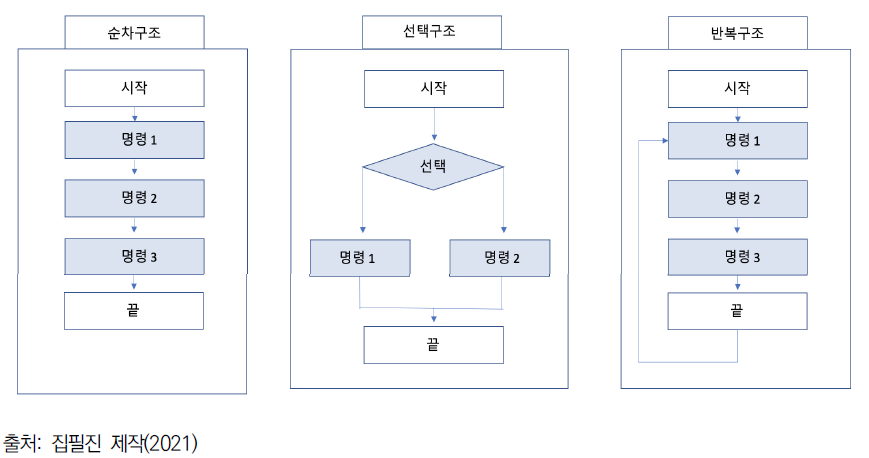

# Clean Architecture 1부 (1 ~ 15장)

## Driver: 이승준

---

# Clean Architecture?


`컴퓨터 시스템의 하드웨어 구조를 말합니다. 아키텍처는 컴퓨터 시스템을 구성하고 있는 하드웨어 장치인 CPU, 레지스터, 기억 장치, 입출력 장치 등과 같은 여러 가지 컴퓨터 구성 요소들에 대한 전반적인 기계적 구조와 이를 설계하는 방법`

---

# 아키텍처의 목표

`필요한 시스템을 만들고 유지보수하는 데 투입되는 인력을 최소화하는데 있다.`


---

# 두 가지 가치

- 행위 가치
- 구조 가치 => 변경하기 쉬워야 한다.

`프로그램을 동작하게 만들기는 그리 어려운 일이 아니다. 하지만 프로그램을 제대로 만드는 일은 전혀 다르다. 소프트웨어를 올바르게 만드는 일은 어렵다.`

---


일반적으로 업무 관리자는 행위 가치에 더 높은 가치를 둘 것이다.

### But!

**아키텍처의 중요성을 설득하는 일은 소프트웨어 개발팀이 마땅히 책임져야 한다.**

---

# 아키텍처는 Code로부터 시작된다. Clean Code!


---

# 패러다임

프로그래밍을 하는 방법. `프로그래머에게서 특정 권한을 박탈(규칙 부과)함으로써 구조를 잡아준다`

- 구조적 프로그래밍
- 객체 지향 프로그래밍
- 함수형 프로그래밍

---

# 구조적 프로그래밍

`제어 흐름의 직접적인 전환에 대한 규칙을 부과`

- 제약 없는 go to문의 해로움 => 이해하기도 힘들고, 모듈을 더 작은 단위로 재귀적 분해하기 힘들게 만든다.
- 프로그램을 결합하는 3가지 방법인 순차, 분기, 반복만으로 충분히 계산 가능한 함수를 표현할 수 있다는 이론적 기반으로 탄생. (if/then/else, do/while 과 같은 단순 제어 구조 사용)

`이해도와 수정의 용이성이 높아지고, 모듈을 기능적으로 분해할 수 있게 되었다는 점에서 의의가 있다.`



---

# 객체 지향 프로그래밍

`제어 흐름의 간접적인 전환에 대한 규칙을 부과`

- 캡슐화
- 상속
- **다형성** => 거의 필살기
  - 의존성 역전

---

# 의존성 역전


- 일반적으로 소스 코드의 흐름은 제어의 흐름을 따르게 된다.
- ML1 과 I 인터페이스 사이 소스코드 의존성이 제어흐름과는 반대가 된다.

**`위 방법을 통해서 시스템의 소스 코드 의존성을 원하는 방향으로 설정할 수 있게 됨`**

## 아키텍트 관점에서도!

`고수준 정책 모듈을 저수준 세부사항 모듈로부터 독립시킬 수 있다.`

---

# 함수형 프로그래밍

`할당문에 대해 규칙을 부과. 프로그래밍의 함수를 수학적 함수처럼 적용하려함.`

- 클로저
- 순수성 (불변성)

경합조건, 교착상태, 동시 업데이트 등의 문제는 모두 가변 변수로 인해서 발생한다!
=> 순수성을 통해서 부수효과(side-effect)를 없앰!


---

**순수함수**

- 동일한 입력에 대해서 항상 같은 결과값
- 부수효과가 없음

```typescript
// not pure
let number = 1;

function increase(amount) {
  number += amount; // side effect
}

function now() {
  console.log(new Date());
}
```

---

```typescript
// pure
function add(a, b) {
  return a + b;
}

function changeState(state, val) {
  const clonedObject = _.clone(state);
  clonedObject.a = val;

  return clonedObject;
}
```

---

**완전한 불변성이 가능한가?**
컴퓨터 자원(저장공간, 처리능력)이 무한하다는 전제 하에 가능


---


`함수와 데이터 구조를 클래스로 배치하는 방법, 이들 클래스를 서로 결합하는 방법을 결정하는데 필요한 원칙`

---

# Single Responsibility Principle (SRP)

> 각 소프트웨어 모듈은 변경의 이유가 단 하나여야만 한다.

변경의 이유: 변경을 요청하는 한 명 이상의 집단(액터)를 의미함.

---


---

# Open-Closed Principle (OCP)

> 확장에는 열려있고, 수정에는 닫혀있어야 한다.

코드를 수정하기보다 새로운 코드를 추가하는 방식으로 설계해야 쉽게 변경할 수 있다.

---


---

# Liskov Substitution Principle (LSP)

> 상호 대체 가능한 구성요소를 이용해 소프트웨어 시스템을 만들 수 있으려면 이들 구성요소는 반드시 서로 치환 가능해야 한다.

- OO언어의 경우 상속을 통해서 쉽게 치환이 가능.
- OCP 가 가능하도록 한다.

---


---

# Interface Segeregation Principle (ISP)

> 사용하지 않는 것에 의존하지 않는다.

일반적으로 필요 이상으로 많은 것을 포함하는 모듈에 의존하는 것은 해롭다.
=> 불필요한 재컴파일, 재배포

---


---

# Dependency Inversion Principle (DIP)

> 고수준 정책을 구현하는 코드는 저수준 세부사항을 구현하는 코드에 절대 의존해서는 안된다. 대신 세부사항이 정책에 의존해야 한다.
> 추상화는 세부 사항에 의존하지 않는다.

=> **_변화하기 쉬운 것보다 변화하지 않는 것에 의존하라!_** \*\*\*\*\*

---


---

# DIP 를 위한 코딩 실천 사항

> ---

- 변동성이 큰 구체 클래스를 참조하지 말라. 대신 추상 인터페이스를 참조하라.
- 변동성이 큰 구체 클래스로부터 파생(extends)하지 말라.
- 구체 함수를 오버라이드 하지 않는다. 차라리 추상 함수로 선언하고 구현체들을 분리한다.
- 고수준에서 구체적이고 변동성이 크다면 그 이름을 절대로 언급하지 마라.

---

# 컴포넌트 원칙

1. 컴포넌트?
1. 컴포넌트 응집도 원칙
   - 재사용/릴리스 등가 원칙
   - 공통 폐쇄 원칙
   - 공통 재사용 원칙
1. 컴포넌트 결합 원칙
   - 의존성 비순환 원칙
   - 안정된 의존성 원칙
   - 안정된 추상화 원칙


---

# 컴포넌트?

`시스템의 구성 요소로 배포할 수 있는 가장 작은 단위다. 따라서 독립적으로 개발 가능해야 한다.`


---

# 컴포넌트 응집도

`어떤 클래스를 어떤 컴포넌트에 포함시켜야 할까?`

---

## 재사용/릴리스 등가 원칙 (REP)

> 재사용 단위는 릴리스 단위와 같다.

- 하나의 컴포넌트로 묶인 클래스, 모듈들은 반드시 **함께 릴리스할 수 있어야 한다**.

단일 컴포넌트는 응집성 높은 클래스와 모듈들로 구성되어야함. 컴포넌트를 구성하는 모든 모듈은 서로 공유하는 중요한 테마나 목적이 있어야 한다.
=> 추상적이다. 뭐 어쩌라는거지?

---

## 공통 폐쇄 원칙 (CCP)

> 동일한 이유, 동일한 시점에 변경되는 클래스를 같은 컴포넌트로 묶는다.

- SRP 원칙을 컴포넌트 관점에서 본 원칙.
- 물리적 또는 개념적으로 강하게 결합되어 항상 함께 변경되는 클래스들을 하나의 컴포넌트로 묶는다.
- 변경이 여러 컴포넌트에 분산되어 발생하기보다 하나의 단일 컴포넌트로 제한하는 것이 안정성이 높음.
- 릴리스, 재검증, 배포하는 일과 관련된 작업을 최소화 가능

---

## 공통 재사용 원칙 (CRP)

> 컴포넌트 사용자들을 필요하지 않는 것에 의존하게 강요하지 말라.

- ISP 의 포괄적인 버전
- 같이 재사용되는 경향이 있는 클래스와 모듈들은 같은 컴포넌트에 포함시킨다.
- 사용하지 않는 클래스를 가진 컴포넌트에 의존하지 마라!

---

## 균형

> 이 세가지 원칙은 서로 상충되기 때문에 현재 개발팀에서 필요한 부분, 그리고 시간이 흐르면서 주의를 기울이는 부분을 이해하고 균형을 잘 잡아서 선택해야 한다

재사용성과 개발 가능성이라는 상충하는 힘을 고려해야 한다.


---

# 컴포넌트 결합

컴포넌트 사이의 관계를 설명

---

## 의존성 비순환 원칙(ADP)

> 컴포넌트 의존성 그래프에 순환이 있어서는 안된다.

- 개발 환경을 릴리스 가능한 단위로 분리 => 단일 개발자, 또는 개발팀이 책임질 수 있는 작업 단위가 된다. 다른 팀은 릴리스를 그저 사용한다.
  - 릴리스해도 즉각적인 영향을 주지 않는다.
  - 릴리스 버전에 맞춰서 수정할 시기를 스스로 결정 가능
  - 작고 점진적으로 수정이 이뤄질 수 있음.

**위가 가능하기 위해서는 의존성 구조에 순환이 있어서는 안된다!**

---


### 만약 Entities 가 Authorizer 를 의존하게 된다면?

- 컴포넌트가 서로 영향을 받게되면서 릴리즈하기 어려워진다
- 순환이 생긴 곳이 사실상 하나의 거대한 컴포넌트가 되어버림
- 어떤 순서로 빌드를 해야하는지 올바르게 파악하기 힘들어진다 (일반적으로는 상향식)

---

### 순환 끊기

- 의존성 역전
  
- 컴포넌트 추가
  

---

## 안정된 의존성 원칙 (SDP)

> 더 안정적인 방향으로 의존하라.

변경이 쉽지 않은 컴포넌트가 변경이 예상되는 컴포넌트에 의존하게 만들어서는 안된다. 의존하게 되면 변동성이 큰 컴포넌트도 결국 변경이 어려워진다.

---

### 안정성 지표

- Fan-in: 안으로 들어오는 의존성. 컴포넌트 내부의 클래스에 의존하는 컴포넌트 외부의 클래스 개수
- Fan-out: 바깥으로 나가는 의존성. Fan-in 과 반대
- I(불안정성): 0 ~ 1 의 범위를 갖는 값으로 높을수록 불안정함을 나타냄.
  > I = Fan-out / (Fan-in + Fan-out)

**SDP 원칙에 따라 의존성 방향으로 갈 수록 I 값은 감소해야 한다!**

---

## 안정된 추상화 원칙 (SAP)

> 컴포넌트는 안정된 정도만큼만 추상화되어야 한다.

안정된 컴포넌트는 추상 컴포넌트여야 하며, 이를 통해 안정성이 컴포넌트를 확장하는 일을 방해해서는 안된다. ⇒ 안정적인 컴포넌트는 인터페이스와 추상 클래스로 구성되어 쉽게 확장할 수 있어야 한다.

---

SDP: 의존성은 안정성 방향으로

SAP: 안정성이 결국 추상화를 의미

⇒ **결국 의존성은 추상화의 방향으로 흐른다**

---

### 추상화 계수

- Nc: 컴포넌트의 클래스 갯수
- Na: 컴포넌트의 추상 클래스와 인터페이스 갯수
- A(추상화 정도)

  > A = Na / Nc

---

## 주계열


- 고통의 구역 (안정 + 추상적 X) => 확장할 수 없고, 변경하기도 힘듬.
- 쓸모없는 구역 => 최고로 추상적이지만 누구도 의존하지 않는다.

---

## 결론

> 지표는 설계의 의존성과 추상화 정도가 얼마나 잘 설계되었나 측정하고, 인사이트를 제공한다는 점에서 의의가 있다. **하지만 결국 지표 또한 정답이 아니다!** 일반적으로 정답에 가까울 뿐!

---

# 아키텍처

## 아키텍트는 코딩 안하나요?


---

    아키텍트는 프로그래머이며, 앞으로도 프로그래머로 남는다!

`⇒ 아키텍트는 코드에서 탈피하여 고수준의 문제에만 집중하는 것이 아니다. 코드와 동떨어지지 말고, 나머지 팀원들의 생산성을 극대화할 수 있는 설계를 하도록 방향을 이끌어줘야 한다`

---

## 개발

> 아키텍처는 개발팀들이 시스템을 쉽게 개발할 수 있도록 뒷받침해야 한다.

- 팀 구조 ⇒ 아키텍처 결정에 영향

- 작은 개발자 팀 ⇒ 모노리틱으로도 가능. 오히려 아키텍처가 방해된다고 여길 가능성이 높다.

- 개발팀이 많으면? ⇒ 신뢰할 수 있고 안정된 인터페이스를 갖춘, 잘 설계된 컴포넌트 단위로 분리하지 않으면 개발이 진척되지 않는다.

---

## 배포

> 배포 비용이 높을수록 시스템의 유용성이 떨어진다. ⇒ 배포를 쉽게 할 수 있도록 목표를 두어야 함.

예를들어 마이크로 서비스 아키텍처는 경계가 매우 뚜렷하고, 인터페이스가 대체로 안정되어 쉽게 개발 가능하지만 배포할 것이 많아서 배포가 힘들 수 있음. 배포 순서도 문제.

---

## 운영

- 아키텍처가 운영에 미치는 영향은 개발, 배포, 유지보수에 미치는 영향보다는 덜 극적임. 운영의 문제는 대부분 하드웨어를 더 투입해서 해결할 수 있다.

- 하드웨어는 값싸고 인력은 비싸다! ⇒ 운영을 방해하는 아키텍처가 개발, 배포, 유지보수를 방해하는 아키텍처보다는 비용이 덜 든다.

---

## 유지보수

유지보수는 모든 측면에서 봤을 때 소프트웨어 시스템에서 **비용이 가장 많이 든다.** 새로운 기능은 끝도 없이 행진하듯 발생하고 뒤따라서 발생하는 결함은 피할 수 없으며, 결함을 수정하는 데도 엄청난 인적 자원이 소모된다.

---

# 선택사항 열어두기

> 빠르고 쉽게 변경하기 위해서 유연성 있게 만들기 위해서는 선택사항을 가능한 많이, 그리고 가능한 오랫동안 열어두어야 한다.

무엇을 열어둬야 하는가? ⇒ 중요하지 않은 세부사항! (ex - 웹 프레임워크, DB, 등등)

- 업무 규칙과 업무 절차를 구체화 하는 **정책 요소**를 **세부사항**에 영향을 받지 않도록 설계하는 것이 중요!
- 세부사항으로부터 독립된 고수준의 정책을 만들 수 있다면, 이러한 세부사항에 대한 결정을 오랫동안 미루거나 연기할 수 있다.

---

# Front-end architecture

> 우리에게 적용점이 있을까?

https://bespoyasov.me/blog/clean-architecture-on-frontend/
위 링크를 정독하면 도움이 될 것!

---

## 뇌 내 망상편

**만약 우리가 react-native 개발을 했다면?**

- 같은 코드 베이스의 고수준의 업무 규칙 컴포넌트 생성
- micro (UI) component development (https://bit.dev/) => theme 및 UI 규칙 등을 (UI) Component 단위의 컴포넌트로 만든다.

**반대로 javascript to kotlin, swift transpile?**

    일단 코드 수준의 컴포넌트 분리부터!

---

# Q n A

---

# talk & talk

- 현재 우리 팀에서 발생하는 문제들은 무엇이 있을까?, 아키텍처를 통해서 해결할 수 있는가?
